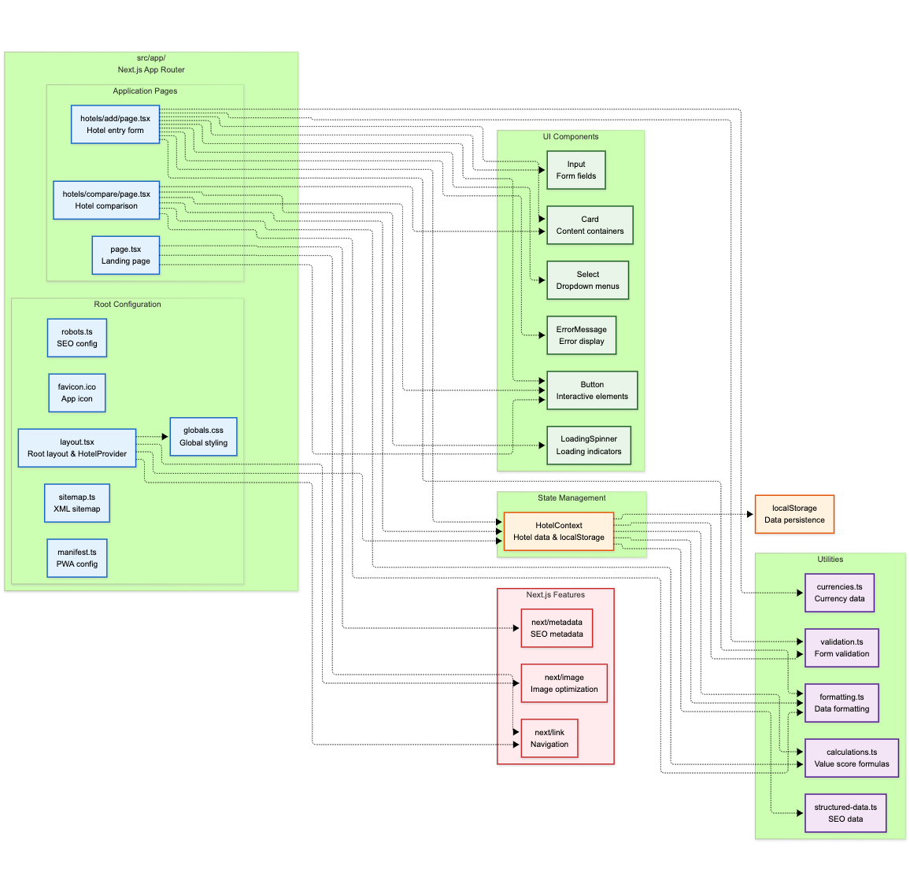
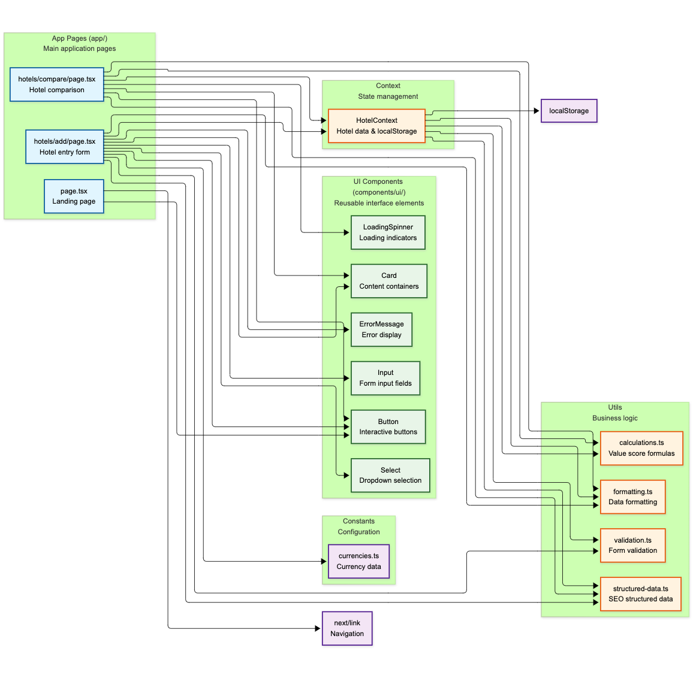

# Architecture Documentation

## Overview

SakuYado is a hotel value comparison web application that helps users find the best value accommodations by calculating a "Review/Price Score" (Rating ÷ Price). The application follows a component-based architecture with centralized state management.

## Application Architecture

### Tech Stack

- **Next.js 15** with App Router
- **React 18** with TypeScript
- **Tailwind CSS v4** for styling
- **React Context + useReducer** for state management

### Core Architecture Pattern

**Component-Based Architecture** with **Context API**:

1. **Modular Components**: Reusable UI components with clear responsibilities
2. **Centralized State**: HotelContext manages all hotel-related state
3. **Separation of Concerns**: UI, business logic, and data management are distinct
4. **Type-Safe Development**: Full TypeScript integration

### Key Decisions

- **Context API over Redux**: Simpler, built-in solution with predictable state updates
- **LocalStorage Persistence**: Hotel data persists across browser sessions
- **Mobile-First Design**: Optimized for mobile (375px) with desktop support (1280px+)

## App Router Architecture

The `src/app/` directory follows Next.js 15 App Router conventions with a hierarchical structure optimized for hotel value comparison functionality.

### Core Structure

**Layout Components:**

- `layout.tsx`: Root layout with HotelProvider wrapper, header, and global styling
- `globals.css`: Tailwind CSS v4 styling with pink/rose color scheme

**Main Pages:**

- `page.tsx`: Landing page with hero section and navigation CTAs
- `hotels/add/page.tsx`: Hotel entry form with validation
- `hotels/compare/page.tsx`: Hotel comparison and ranking display

**SEO & Metadata:**

- `manifest.ts`: Progressive Web App configuration
- `robots.ts`: Search engine crawling instructions
- `sitemap.ts`: XML sitemap generation

### App Router Integration

**HotelProvider Context:**

- Wrapped around all pages in layout.tsx:120
- Provides centralized state management across the application
- Handles localStorage persistence and currency preferences

**Responsive Design:**

- Mobile-first approach (375px) with desktop support (1280px+)
- Sakura-themed decorative elements and animations
- Gradient backgrounds and consistent spacing

## Component Architecture

### UI Component Library

Reusable components in `src/components/ui/`:

| Component | Purpose |
|-----------|---------|
| **Button** | Interactive actions with variants (primary, secondary, danger) |
| **Input** | Form fields with labels, icons, and error handling |
| **Select** | Dropdown selection with accessibility support |
| **Card** | Content containers with gradient/highlight variants |
| **ErrorMessage** | Consistent error message display |
| **LoadingSpinner** | Loading indicators with custom messages |

### Component Design Patterns

**Stateless Components**: All UI components receive data via props, business logic handled by context

**Composition over Inheritance**: Components built for reusability with flexible prop interfaces

**Accessibility-First**: Semantic HTML, ARIA labels, keyboard navigation, screen reader support

### Component Relationships

**Page Integration:**

- **Home Page**: Navigation with CTAs
- **Add Hotel Page**: Complex form with validation
- **Compare Page**: Data display with interactive elements

**State Integration:**

- Components consume HotelContext via hooks
- User interactions trigger context actions
- Real-time updates across the application
