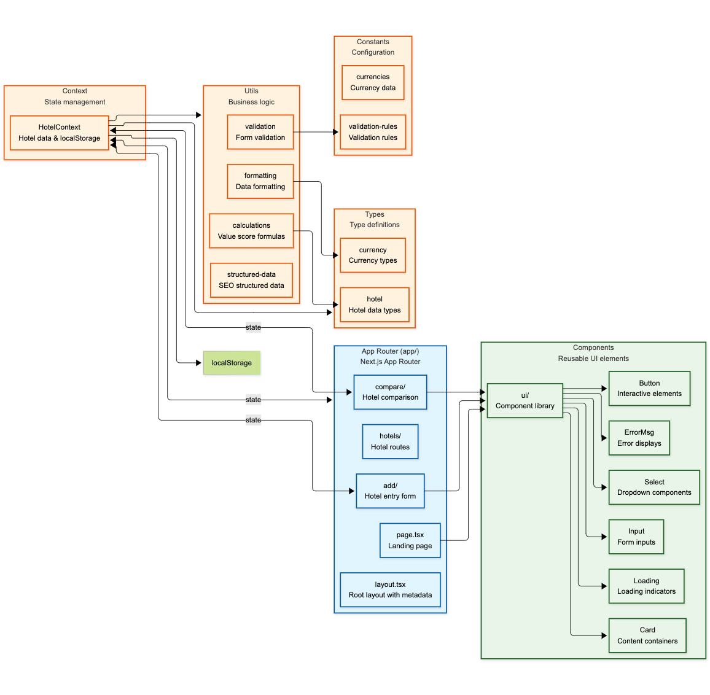

# Architecture Documentation

## Table of Contents
1. [Overview](#overview)
2. [Directory Structure](#directory-structure)
3. [Core Architecture](#core-architecture)
4. [State Management](#state-management)
5. [Data Flow](#data-flow)
6. [Key Components](#key-components)

## Overview



The SakuYado application is built with a modern tech stack focused on performance, scalability, and maintainability. The architecture follows a modular approach with clear separation of concerns.

## Directory Structure

```
src/
├── app/                    # Next.js App Router pages
│   ├── hotels/
│   │   ├── add/           # Hotel entry form
│   │   └── compare/       # Hotel comparison view
│   ├── layout.tsx         # Root layout with providers
│   └── page.tsx           # Landing page
├── components/
│   └── ui/                # Reusable UI components
├── contexts/              # React contexts
├── constants/             # App constants (currencies, etc.)
├── types/                 # TypeScript type definitions
└── utils/                 # Utility functions
```

## Core Architecture

### Frontend Framework

- **Next.js 15** with App Router
- **React 18** with TypeScript
- **Tailwind CSS** for styling

## State Management

- **HotelContext**: Central state using React Context + useReducer
- **localStorage** persistence for hotel data
- **Currency** preferences stored locally

## Data Flow

1. Hotel data → localStorage → Context initialization
2. Value score calculation: `Rating ÷ Price`
3. Automatic sorting by value score
4. Real-time updates across components

## Key Components

- **Hotel Management**: Add, compare, and rank hotels
- **Multi-currency Support**: Automatic currency conversion
- **Responsive Design**: Mobile-first approach
- **SEO Optimized**: Structured data and meta tags

---

*Future sections will be added as the application grows in complexity.*
